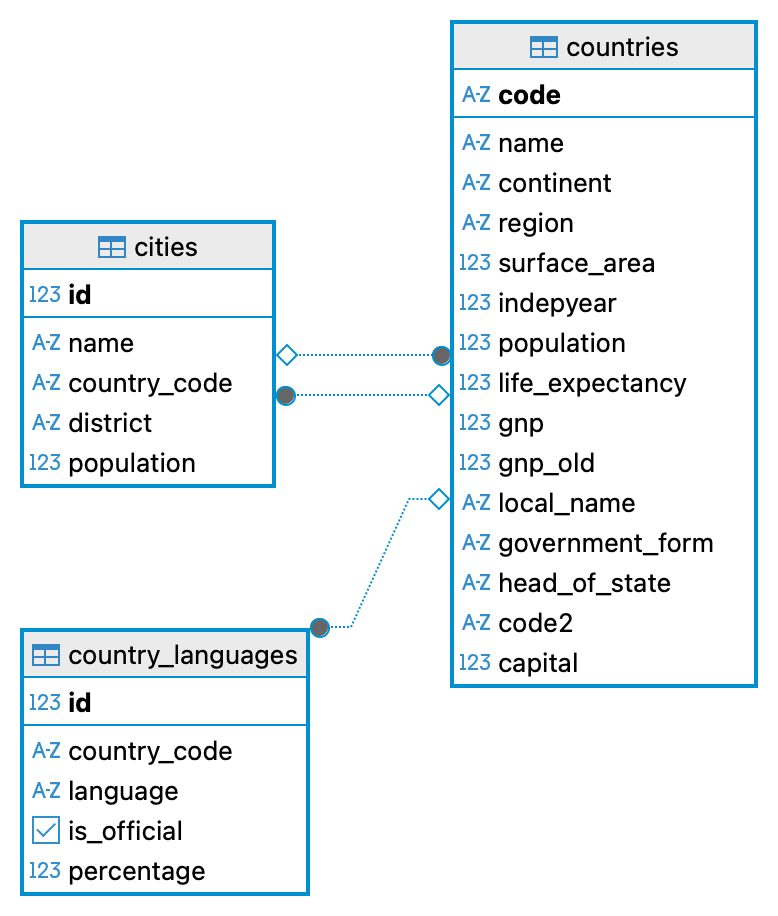
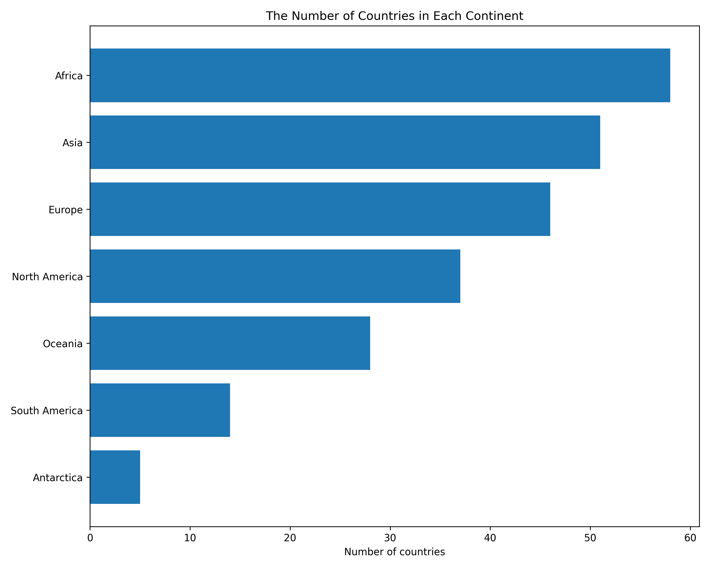
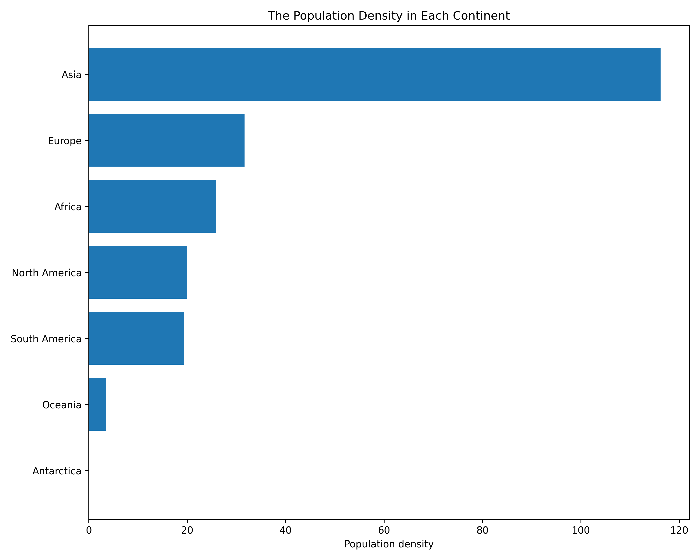
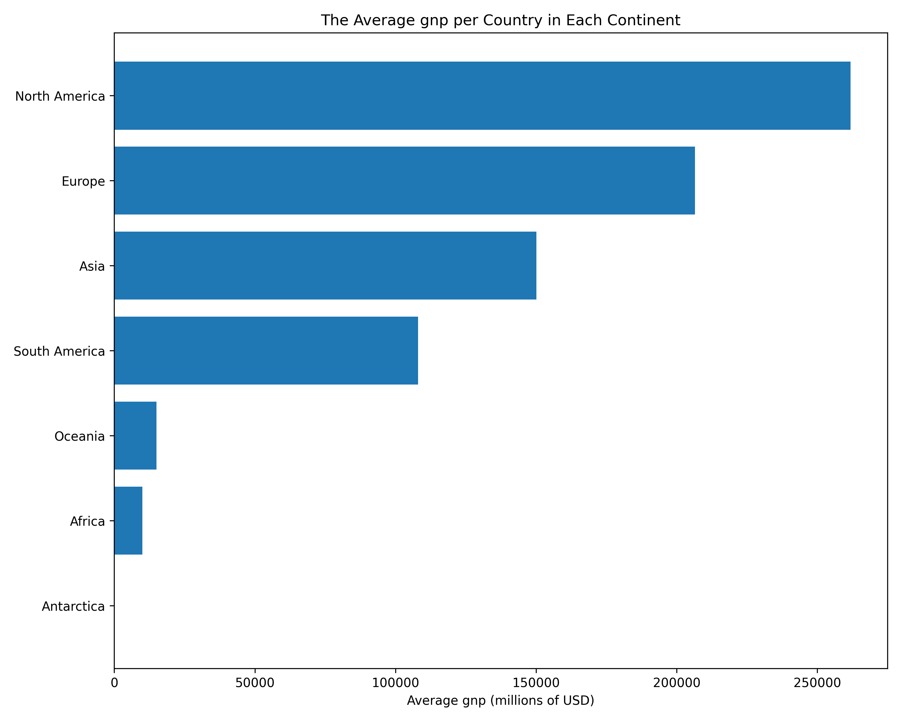
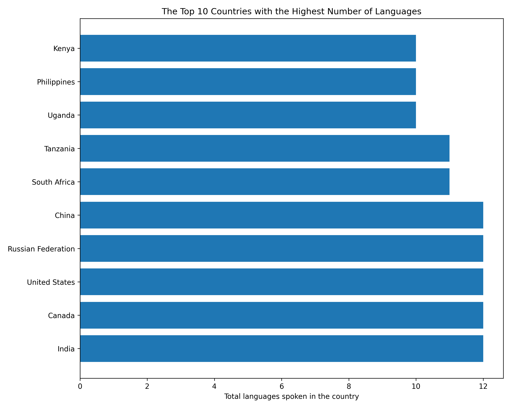
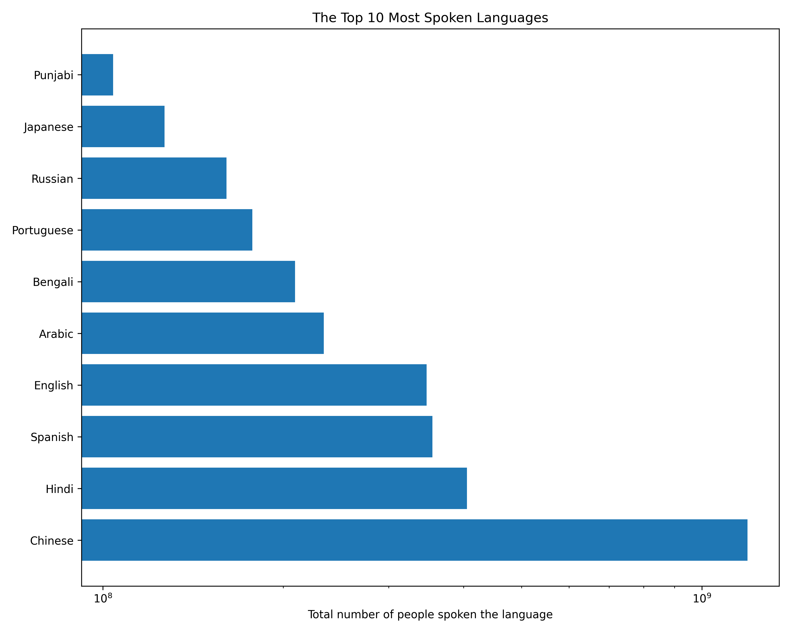

# Exploratory Data Analysis for the World Cities, Countries & Languages Dataset

### Part I: Import data from the csv files and create the PostgreSQL database
The original dataset and description can be found on [Kaggle](https://www.kaggle.com/datasets/adilshamim8/world-cities-countries-and-languages-dataset/data)

This [script](SQL_scripts/World_Cities_Countries_and_Langauges_Schema.sql) is used to import data and create the PostgreSQL database schema. 

The following database schema diagram demonstrates the relationships among the three tables:

### Part II: Exploratory data analysis

1. Check if the column contains missing values

In this [script](SQL_scripts/Check_null.sql), a function named `check_null()` is created, which can check if any columns in the input table contain missing values. Both `cities` and `country_languages` tables are complete except for `countries` table.

Code: 

`select * from check_null('countries');`

Output:

| col_name        | count_null |
|-----------------|------------|
| code            | 0          |
| name            | 0          |
| continent       | 0          |
| region          | 0          |
| surface_area    | 0          |
| indepyear       | 47         |
| population      | 0          |
| life_expectancy | 17         |
| gnp             | 0          |
| gnp_old         | 61         |
| local_name      | 0          |
| government_form | 0          |
| head_of_state   | 3          |
| code2           | 0          |
| capital         | 7          |

2. Describe the numeric variables

This [script](SQL_scripts/Describe_numeric_variables.sql) creates a function `describe_numeric_variables()`, which first identifies the numeric variables and then computes the min, max, mean, median, lower quantile and upper quantile for each numeric column in the table. 

Example:

`select * from describle_numeric_varaibles('cities');`

Output:
| col_name   | min_val | max_val  | mean_val            | median_val | lower_quantile | upper_quantile |
|------------|---------|----------|---------------------|------------|----------------|----------------|
| id         | 1       | 4079     | 2040                | 2040       | 1020.5         | 3059.5         |
| population | 42      | 10500000 | 350468.223584211817 | 167051     | 114789         | 310638.5       |

3. Plotting data

This [script](SQL_scripts/Plots.sql) is used to visualize the data.

The following plots are generated:

4. Functions for checking the detailed information of a given country

Two additional [functions](SQL_scripts/Functions_for_check_details.sql) are written. 

The first function `check_capital_language()` retrives the capital and the official language of a given country from the database. 

Example: 

`select * from check_capital_language('France');`

Output:

| country_name | capital | language |
|--------------|---------|----------|
| France       | Paris   | French   |

The other function `check_cities()` retrives the name and populations of cities belonging to a given country and order the cities by the population in the descending order.

Example: 
`select * from check_cities('France');` 

Output: 
[Table 1](outputs/Cities_in_France.csv)
